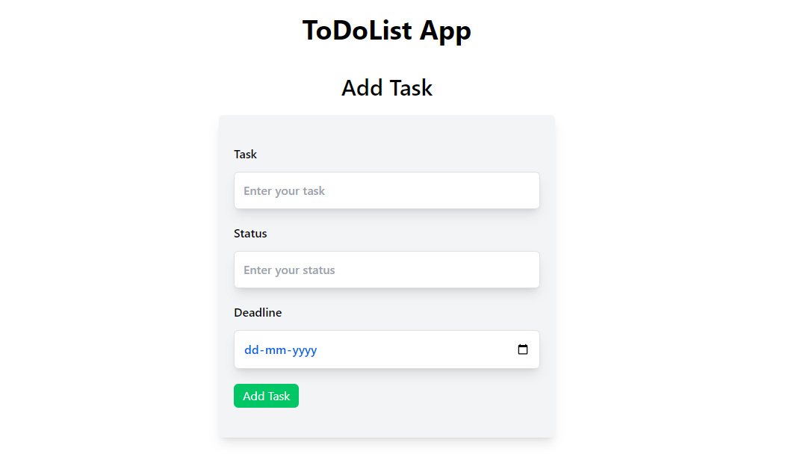
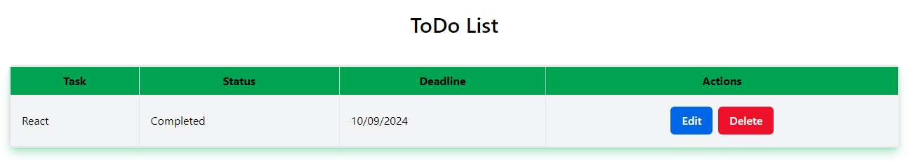
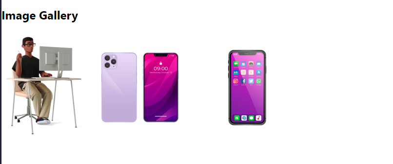
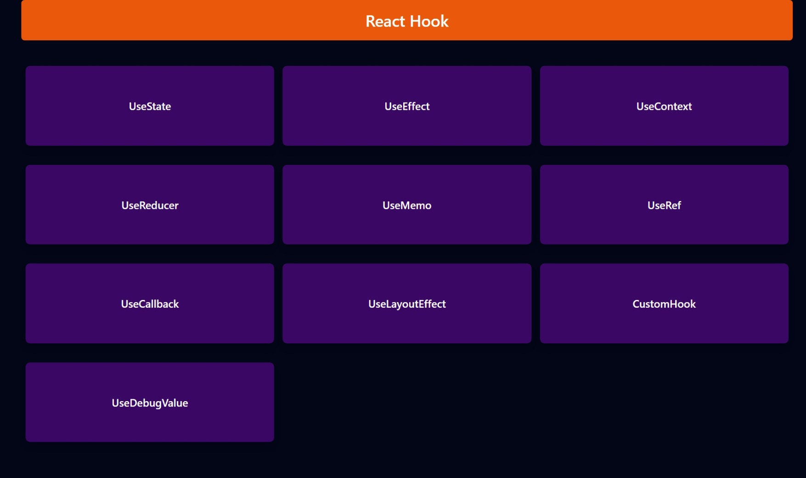
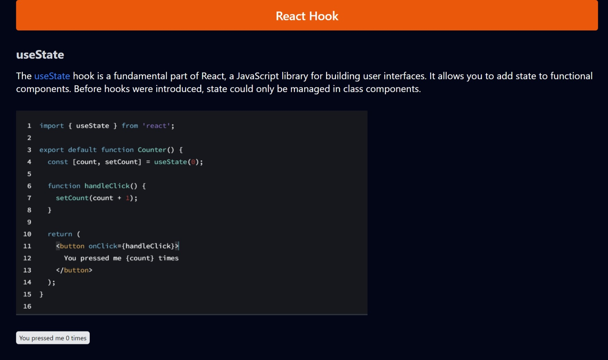
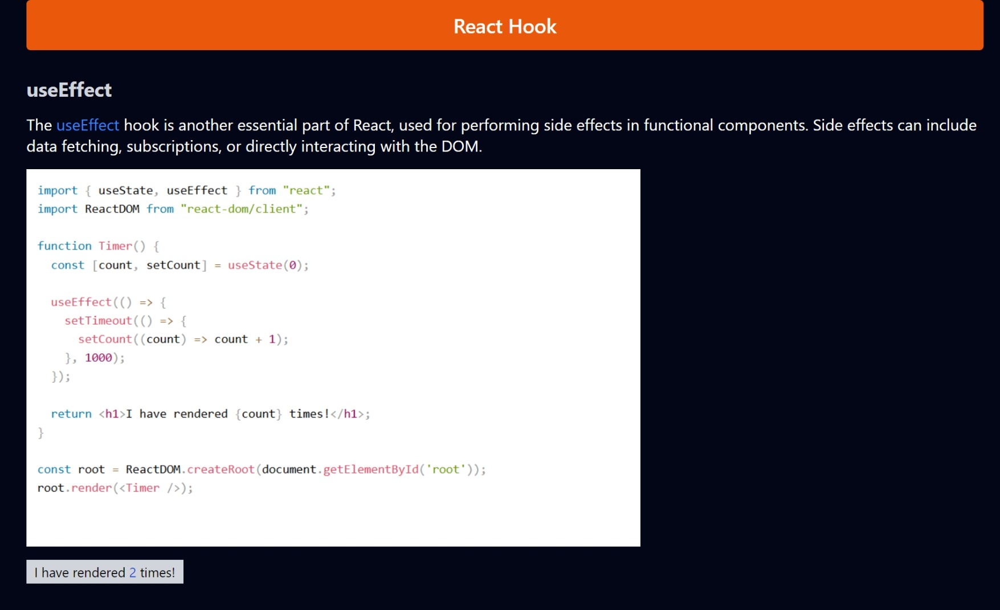

# React Project Exercise

## Table of Contents

- [SimpleToDo](#todoapp)
- [MulterWithMongoDB](#multerwithmongodb)
- [TaskManager](#taskmanager)
- [PasswordGenerator](#passwordgenerator)
- [LearnReactRedux](#learnreactredux)
- [NewsApp](#newsapp)
- [Search Functionality](#searchfunctionality)
- [Yourlogo](#yourlogo)

## SimpleToDo

This is simple mern todo project.

- In this project using CRUD Operation

1. React
2. Nodejs
3. MongoDB
4. Express




## MulterWithMongoDB

In this project, I learn how to use Multer or Multer with MongoDB

How to Upload image or Get image.




## TaskManager

In this project, I learn how to use Task Manager.


## PasswordGenerator 


## LearnReactRedux
How to manage state in React.


## NewsApp


## NextJs CRUD App


## SearchFunctionality


## Yourlogo


## Password Hide and Show


## Zod


## React Hook



### useState Hook



### useEffect Hook


# JWT

**JSON WEB TOKEN (JWT)** are an open standard (RFC 7519) for securely transmitting information between parties as a JSON object.
This information can be verified and trusted because it has digitally signed. JWTs are commonly used for authentication and informatin exchange.

### Structure of a JWT

A JWT consists of three parts

1. **Header**: Contains metadata about the token, including the type of token (JWT) and the signing algorithm used (e.g HS256).

2. **Payload**: Contains the claims, which are statements about an entity (typically, the user) and additional data. There are registered claims like iss (issuer), exp (expiration time), and custom claims.

3. **Signature**: Ensures that the token hasn’t been altered. It is created by encoding the header and payload, concatenating them with a period, and signing them using the specified algorithm.


```json
{
  "header": {
    "alg": "HS256",
    "typ": "JWT"
  },
  "payload": {
    "sub": "1234567890",
    "name": "John Doe",
    "iat": 1516239022
  },
  "signature": "SflKxwRJSMeKKF2QT4fwpMeJf36POk6yJV_adQssw5c"
}
```

### USE Cases

* **Authentication**: After a users logs in, a JWT can be generated and sent to the client. The client can then include this token in the header of subsequent requests to ensure to access protocted routes.

* **Information Exchange**: JWTs can be used to exchange information between parties. Since they are signed the receiving party can verify the integrity and authenticity of the data.


# Cookie

**HTTP cookies** are small pieces of data sent from a website and stored on the user's computer by the user’s web browser while the user is browsing. They are designed to be a reliable mechanism for websites to remember stateful information or to record the user’s browsing activity.

### Key Points about Cookies

1. **Purpose**: Cookies are used for various purposes, such as session management, personalization, and tracking.

2. **Types**: 

   * **Session Cookies**: Temporary cookies that are deleted when you close your browser.

   * **Persistent Cookies**:  Remain on your device for a set period or until you delete them.

   * **Secure Cookie**: Only transmitted over secure HTTPS connections.

   * **HttpOnly Cookie**:  Not accessible via JavaScript, enhancing security.

3. **Components**:

   * **Name**: The name of the cookie.
   * **Value**: The value stored in the cookie.
   * **Domain**: The domain that the cookie is available to.
   * **Path**: The path that the cookie is available to.
   * **Expires/Max-Age**: The expiration date or maximum age of the cookie.
   * **Secure**: Indicates if the cookie should only be transmitted over secure protocols.
   * **HttpOnly**: Indicates if the cookie should not be accessible via JavaScript.

### Example
Here's an example of setting a cookie in javascript:

```javascript
document.cookie = "username=JohnDoe; expires=Fri, 31 Dec 2024 23:59:59 GMT; path=/";
```

### Use Cases
  * **Session Management**:  Keeping users logged in as they navigate through different pages.

  * **Personalization**: Storing user preferences and settings.

  * **Tracking**: Monitoring user behavior for analytics and advertising purposes.

## Session

In the context of web development, a **session** typically refers to a way to store information (in variables) to be used across multiple pages. Unlike cookies, the data is not stored on the user’s computer but on the server.


### Key Points about Session

1. **Session Management**: Sessions are used to manage user state and data across different pages of a web application. This is crucial for functionalities like user authentication.

2. **Storage**: Session data is stored on the server, and a session ID is stored in a cookie on the client-side. This ID is sent with each request to the server to retrieve the session data.

3. **Security**: Sessions are generally more secure than cookies because the data is stored on the server. However, it’s important to secure the session ID to prevent session hijacking.

4. **Libraries and Tools**: In Node.js, you can use libraries like `express-session` to manage sessions.

```javascript
const express = require('express');
const session = require('express-session');

const app = express();

app.use(session({
  secret: 'your_secret_key',
  resave: false,
  saveUninitialized: true,
  cookie: { secure: true }
}));

app.get('/', (req, res) => {
  if (req.session.views) {
    req.session.views++;
    res.send(`Number of views: ${req.session.views}`);
  } else {
    req.session.views = 1;
    res.send('Welcome to the session demo. Refresh!');
  }
});

app.listen(3000, () => {
  console.log('Server is running on port 3000');
});

```

## Access Token 

```
An access token is a short-lived credential that grants temporary access to protected resources.
```

## Refresh Token

```
A refresh token is a credential used to obtain new access tokens without requiring the user to re-authenticate.
```